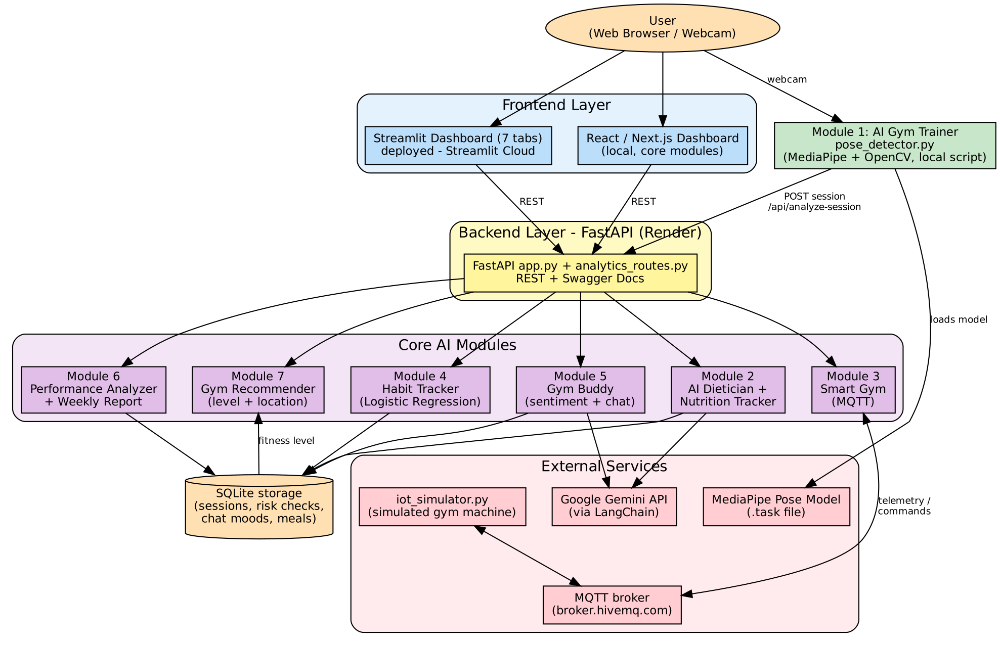

# 🏋️ AI Gym & Fitness Assistant

An AI-powered fitness platform that joins workout detection, diet planning, habit tracking, IoT-based smart gym advice and conversational AI in one system. Built as an internship project for Unlox Academy / Trivion.

## 🔗 Live Demo

- **Dashboard (Streamlit):** https://aigymfitnessassistant-sqktqokhufhzdfac6pdefs.streamlit.app
- **Backend API (Render):** https://ai-gym-backend-bwiz.onrender.com
- **API docs (Swagger):** https://ai-gym-backend-bwiz.onrender.com/docs
- **Source code:** https://github.com/Navyachalla21/ai_gym_fitness_assistant

> The backend runs on Render's free tier. It sleeps when idle, so the first request can take 30–60 seconds. Its disk is also reset on redeploy, so saved history and meals on the live site are not permanent.

## 🏗️ Architecture



## 🧠 The Seven Modules

| # | Module | What it does |
|---|--------|--------------|
| 1 | **AI Gym Trainer** | Webcam pose detection (MediaPipe + OpenCV). Counts bicep curl reps from the elbow angle, warns about elbow drift, beeps for feedback, and sends the finished session to the backend. |
| 2 | **AI Dietician & Calorie Coach** | BMI and a Gemini-generated meal plan and grocery list. Also a daily calorie target (Mifflin-St Jeor) and a meal log that shows calories eaten and remaining. |
| 3 | **Smart Gym Assistant (AI + IoT)** | Reads equipment data (heart rate, resistance, status) live over **MQTT** from a simulated machine and recommends a resistance level and rest time. The Apply button sends the new resistance back to the machine. Falls back to simulated data if no machine is publishing. |
| 4 | **AI Fitness Habit Tracker** | A logistic-regression model predicts skip risk (Low / Medium / High) and suggests a workout schedule that matches the risk, plus a motivational nudge. |
| 5 | **Virtual Gym Buddy** | Gemini chat companion with sentiment detection (negation-aware), a memory of the last 5 turns, and a mood trend. |
| 6 | **Pose-to-Performance Analyzer** | Turns reps, duration and form feedback into a Performance Score, Form Quality % and rating. Sessions are saved, and a **weekly report** with trend and charts is built from them. |
| 7 | **Gym Recommender & Planner** | Suggests programs, challenges and nearby gyms by goal, streak, fitness level (taken from the user's saved history) and city or coordinates. Gyms are sample data. |

### Integration
- Module 1 posts every finished session to `/api/analyze-session` (Module 6), which stores it.
- The stored sessions feed the weekly report, the Admin Analytics tab and the recommender's fitness level.
- Risk checks (Module 4) and chat moods (Module 5) are stored too, so Admin Analytics shows them over time.

## 🛠️ Tech Stack

| Layer | Technology |
|-------|-----------|
| Dashboard | Streamlit (deployed), Plotly charts; Next.js frontend (local, older feature set) |
| Backend | Python, FastAPI |
| AI / ML | Google Gemini via LangChain, MediaPipe PoseLandmarker, OpenCV, scikit-learn |
| IoT | MQTT (paho-mqtt) over `broker.hivemq.com` |
| Storage | SQLite (`GYM_DB_PATH` sets the file location) |
| Deployment | Render (backend), Streamlit Community Cloud (dashboard), Docker files included |

## 📁 Project Structure

```
ai_gym_fitness_assistant/
├── ai_modules/
│   ├── pose_detector.py          # Module 1
│   ├── diet_coach.py             # Module 2
│   ├── nutrition_tracker.py      # Module 2: calorie target + meal summary
│   ├── smart_gym_assistant.py    # Module 3: advice logic
│   ├── mqtt_bridge.py            # Module 3: MQTT subscriber / publisher
│   ├── iot_simulator.py          # Module 3: simulated gym machine
│   ├── behavior_predictor.py     # Module 4
│   ├── gym_buddy_chat.py         # Module 5
│   ├── performance_analyzer.py   # Module 6 + weekly report
│   ├── gym_recommender.py        # Module 7
│   ├── storage.py                # SQLite storage
│   └── pose_landmarker_lite.task # MediaPipe model
├── backend/
│   ├── app.py                    # FastAPI app
│   ├── analytics_routes.py       # analytics, nutrition, live Smart Gym routes
│   └── requirements.txt
├── streamlit_dashboard/
│   ├── app.py                    # 7-tab dashboard
│   ├── admin_analytics.py        # Admin Analytics tab
│   └── nutrition_ui.py           # Nutrition tracker UI
├── frontend/                     # Next.js dashboard
├── run_tests.py                  # 23 API tests
├── testing_report.md
├── docker-compose.yml
└── README.md
```

## 🔌 Main API Endpoints

| Method | Path | Purpose |
|--------|------|---------|
| POST | `/api/diet-plan` | BMI + AI meal plan |
| GET | `/api/calorie-target` | Daily calorie estimate |
| POST / DELETE / GET | `/api/meals`, `/api/meals/{id}`, `/api/meals/summary` | Meal log |
| POST | `/api/behavior-risk` | Skip risk + suggested schedule |
| POST | `/api/gym-buddy-chat` | Chat + sentiment |
| POST | `/api/analyze-session` | Score and store a session |
| GET | `/api/weekly-report` | Weekly report from stored sessions |
| GET | `/api/smart-gym-reading` | Simulated sensor reading |
| GET / POST | `/api/smart-gym-live`, `/api/smart-gym-live/apply` | Live MQTT data and resistance command |
| POST | `/api/recommend`, `/api/recommend-plus` | Recommendations (plus: fitness level and location) |
| GET | `/api/cities` | Cities available for gym lookup |
| GET | `/api/analytics/{summary,sessions,risks,mood,users}` | Admin Analytics |

Full list with try-it forms: `/docs`.

## 🚀 Running Locally

**1. Environment variable** — create `.env` in the project root and in `backend/`:
```
GOOGLE_API_KEY=your_gemini_api_key_here
```
Never commit this file (it is in `.gitignore`).

**2. Backend**
```bash
cd backend
pip install -r requirements.txt
uvicorn app:app --reload --port 8000
```

**3. Streamlit dashboard** (point it at your local backend, otherwise it uses Render)
```powershell
$env:API_URL="http://127.0.0.1:8000"
streamlit run streamlit_dashboard/app.py
```

**4. Smart Gym simulator** (second terminal; makes the dashboard show `source = mqtt`)
```bash
python ai_modules/iot_simulator.py
```

**5. AI Gym Trainer** (webcam; press `q` to finish and send the session)
```bash
python ai_modules/pose_detector.py
```
Set `BACKEND_API_URL` to send to a backend other than `http://localhost:8000`.

**6. Next.js frontend (optional)**
```bash
cd frontend && npm install && npm run dev
```

**7. Docker (optional)**
```bash
docker compose up --build
```

## ✅ Testing

```bash
python run_tests.py http://127.0.0.1:8000
python run_tests.py https://ai-gym-backend-bwiz.onrender.com
```
Both runs pass **23/23**. Results are written to `test_results.md`. The full report, including manual tests (webcam, dashboard, MQTT round trip), is in [testing_report.md](testing_report.md).

## 📌 Known Limitations

- **Gyms are sample data** placed around real city centres, not live map results.
- **Render free tier:** the service sleeps when idle, and its disk resets on redeploy, so history and meals saved on the live site can disappear. Locally they persist.
- **Module 1 runs as a local script**, not in the browser, because it needs direct webcam access.
- **MQTT uses a public broker** with a unique topic name; it is fine for a demo but not private.
- **Next.js frontend** does not include the analytics, nutrition and live MQTT features; use the Streamlit dashboard for the full set.
- **Skip-risk model** is trained on synthetic data (400 rows), so it shows the method rather than real-world accuracy.
- **Performance score** weights pace heavily, so slow, controlled sets score low.
- Docker files are included but the deployed demo uses Render and Streamlit Cloud.

## 👩‍💻 Author

Navyashree K N — Project Intern, Unlox Academy
